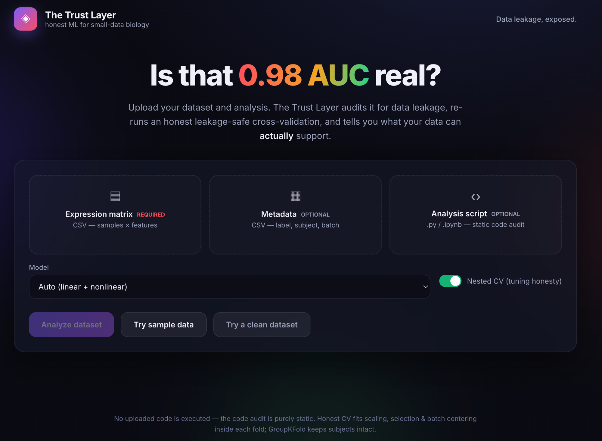
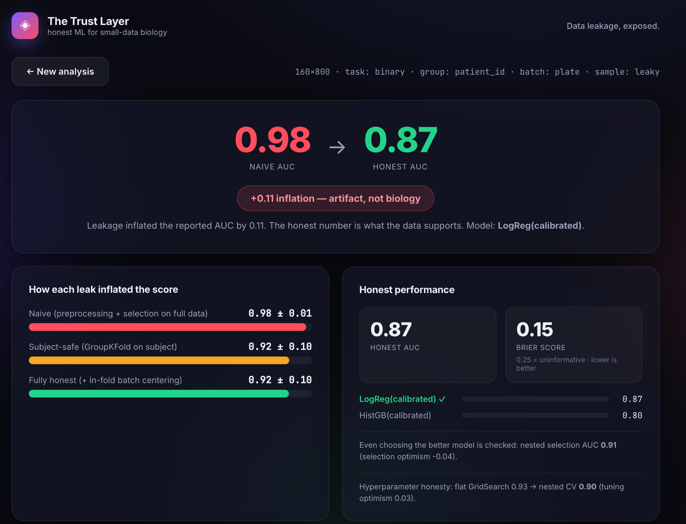
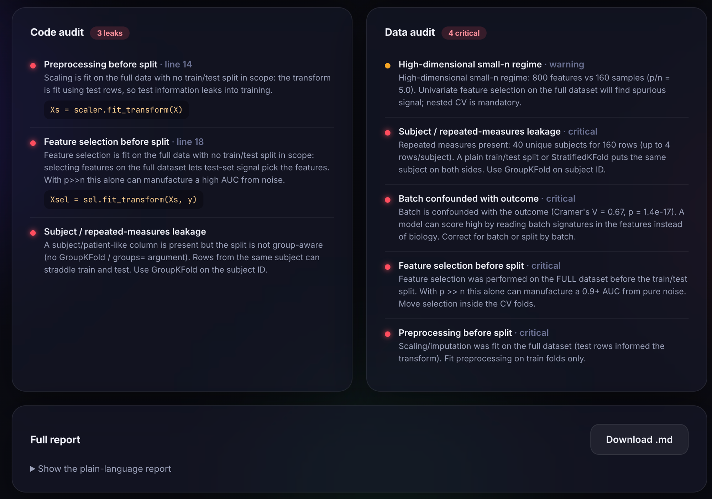

# The Trust Layer — release bundle

> Built for the [Anthropic Research × Built with Claude: Life Sciences hackathon](https://cerebralvalley.ai/e/built-with-claude-life-sciences).

An agentic trust check for small-data biology ML. Point it at a dataset (and,
optionally, the analysis notebook) and it (1) audits for data leakage, (2)
re-runs an honest, leakage-safe cross-validation, (3) fits a calibrated model
with reliable uncertainty, and (4) returns a plain-language report.

**Headline:** on the synthetic benchmark a naive pipeline reports AUC **0.98**;
after closing every leak the honest performance is AUC **0.90** — the +0.08 was
inflation, not biology. On real GEO data (GSE146996), shuffling the labels to
destroy all signal still yields a naive AUC of **0.99**, while honest CV
correctly collapses to **0.54** (chance).

## Web UI

A modern web interface wraps the whole engine — upload your data (and optionally
your analysis script), and get the verdict, the leakage ladder, code + data
audits, and the full report, no code required. Run it with `./webapp/run.sh`
(see [`webapp/`](webapp/)), then open http://localhost:8000.

**Upload your dataset and analysis:**



**The verdict — naive vs. honest performance, with the leakage ladder:**



**Line-anchored code audit and dataset audit, plus the downloadable report:**



## What's in this bundle

### `code/` — the implementation
| File | Purpose |
|---|---|
| `trust_layer.py` | Core engine: `audit_leakage`, `naive_cv`/`honest_cv`, `fit_trust_model` (calibrated linear **and** nonlinear, auto-selected), `nested_model_selection`, `BatchCenterer`, `reliability_curve` |
| `trust_audit.py` | The single entry point `trust_audit(X, y, ...)` chaining code-audit → data-audit → honest CV ladder → model → report |
| `trust_tasks.py` | Task generalization: binary / multiclass / regression + nested CV for tuning honesty |
| `notebook_audit.py` | Static (AST) leakage analyzer for a `.py`/`.ipynb` — no code is executed |
| `demo_dataset.py` | Synthetic small-n biology dataset generator with known ground-truth leaks |
| `demo.py` | **Live-demo script.** `python demo.py` runs the whole pipeline on the sample data in ~35s, ending with the XOR "it auto-switches to the nonlinear model" finale. Flags: `--fast`, `--data DIR`, `--no-finale` |
| `kernel_sidecar.py` | The packaged skill sidecar (`small-data-leakage-audit`), exposing the full API through one auto-loaded module |

### `figures/`
- `fig1_leakage_ladder.png` — the 3-rung honest-CV ladder (0.98 → 0.94 → 0.89)
- `fig2_honest_performance.png` — ROC (leaky vs honest) + calibration reliability curve
- `fig3_realdata_nulltest.png` — GSE146996 shuffled-label null test (the killer demo)
- `fig4_multitask.png` — leakage inflates the score across binary / multiclass / regression
- `fig5_leaky_vs_clean.png` — it flags real leakage but stays quiet on a clean analysis
- `fig6_model_adaptivity.png` — linear-vs-nonlinear auto-selection (biomarker vs XOR)

### `reports/`
Generated plain-language reports and the raw result JSONs (synthetic benchmark,
unified pipeline run, and the GSE146996 real-data validation).

### `notebook_examples/`
Small leaky / clean scripts + a `.ipynb`, used to validate the static code auditor.

### `sample_data/`
- `trust_layer_sample_dataset.zip` — a **leaky** serum-proteomics benchmark (160×800, 40 patients × 4 reps, plate-confounded) with a leaky analysis script, README, and expected results.
- `trust_layer_sample_dataset_clean.zip` — a **clean** counterpart (unique patients, no confound, Pipeline + GroupKFold) that the tool correctly reports as having no inflation.

### `deck/`
`trust_layer_hackathon.pptx` — 13-slide judge deck (9 main + 4 appendix), with
**speaker notes** on every slide (Presenter View: a ~3-minute scripted pitch).

## Quick start

```bash
# from the code/ directory (or add it to PYTHONPATH)
python demo.py                 # full narrated demo on the bundled sample data (~35s)
python demo.py --fast          # linear model only (~24s)
```

Or call it directly:

```python
import trust_layer, notebook_audit, trust_tasks   # load siblings first
import trust_audit
result = trust_audit.trust_audit(
    X, y,                       # samples x features, labels
    groups=patient_ids,         # optional: subject/patient IDs (group-aware CV)
    batch=plate_labels,         # optional: plate/site labels (batch-confound check)
    notebook="analysis.ipynb",  # optional: static code audit
)
print(result["report_md"])
```

**Dependencies:** `scikit-learn`, `scipy`, `pandas`, `numpy` — all standard. No
external model weights or network access required.

*No code from an audited notebook is ever executed — the code audit is purely
static. Honest CV fits scaling, feature selection, and per-batch centering
inside each training fold; GroupKFold keeps subjects intact.*
